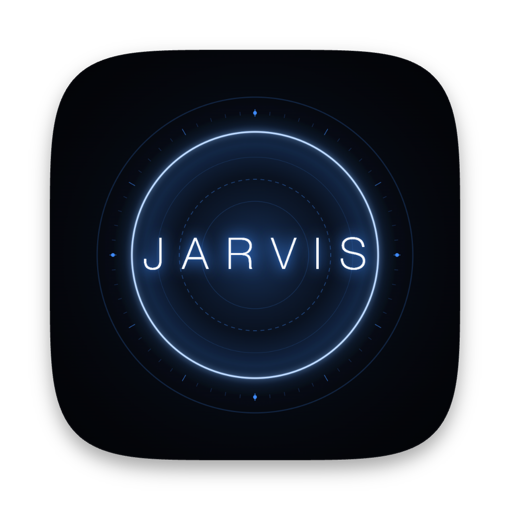

<div align="center">



# Jarvis

**A fully local, always-on AI assistant — voice-activated, multi-agent, with a live browser HUD.**

Built from scratch by [Edward Haddad](https://github.com/e-haddad) and running 24/7 on a Mac Studio M4 Max.

[](https://www.python.org/)
[](https://anthropic.com)
[](https://github.com/openai/whisper)
[](https://elevenlabs.io)
[](LICENSE)

</div>

---

## What It Is

Jarvis is a personal AI system inspired by Tony Stark's assistant — built entirely from scratch. It wakes on a custom wake word, transcribes speech locally with Whisper, routes the query through a parallel multi-agent architecture powered by Claude, and responds in a synthesized British voice via ElevenLabs.

It's not a wrapper around a chatbot. It's a second brain with persistent memory, live tools, sharp opinions, and full read/write access to an Obsidian vault. It knows about active projects, the job search, the calendar, the inbox, and what was last worked on — and it connects those dots without being asked.

---

## Demo

> Wake word → Whisper transcription → parallel agent fan-out → spoken response → live browser HUD

*(Demo video coming soon)*

---

## Architecture

```
Microphone
    │
    ▼
OpenWakeWord ─────────────────────── "Hey Jarvis" detected (hey_jarvis_v0.1, ONNX)
    │
    ▼
webrtcvad ────────────────────────── VAD-based recording — silence-terminated, 30s hard cap
    │
    ▼
Whisper turbo ────────────────────── Local speech-to-text (no cloud)
    │
    ▼
MasterOrchestrator ───────────────── Claude Sonnet decides which agents to spawn
    │
    ├── Career Agent ─────────────── Job search, resume, applications, OPT/visa
    ├── Projects Agent ───────────── Jarvis, Iris, ChipIn, Billed — code + architecture
    ├── Iris Agent ───────────────── Gesture smart home, Raspberry Pi, Tuya devices
    ├── Architect Agent ──────────── System design, technical planning
    ├── Researcher Agent ─────────── Web search, URL summarization
    ├── Coder Agent ──────────────── Code generation, debugging, file I/O
    └── General Agent ────────────── Weather, calendar, memory, Q&A, chat
    │
    ▼
Synthesizer ──────────────────────── Agent results merged into a single spoken response
    │
    ▼
ElevenLabs Flash v2.5 ────────────── Custom British voice (Jarvis 1.0), sentence-level streaming
    │                                Kokoro ONNX v1.0 local fallback (bm_george, en-gb)
    ▼
Browser HUD (port 8765) ──────────── Real-time status, parallel agent panel, conversation log
```

---

## Features

### Voice Pipeline
- Always-on wake word detection via OpenWakeWord (`hey_jarvis_v0.1`, ONNX runtime)
- VAD-based command recording — silence-terminated at 1.2s, 30s hard cap, no fixed duration
- Whisper turbo local transcription — no cloud, no latency penalty
- ElevenLabs Flash v2.5 TTS — custom British male voice, sentence-level audio streaming
- Kokoro ONNX v1.0 local fallback (`bm_george`, `en-gb`) — works fully offline

### Multi-Agent Architecture
- `MasterOrchestrator` uses Claude Sonnet 4.6 to decide which specialist agents to fan out to per turn
- Agents run concurrently via `asyncio` thread-pool fan-out — all specialists respond in parallel
- Per-agent 240s timeout — one slow agent never stalls the batch
- Keyword-first intent classification (free, zero API cost); Haiku fallback only for ambiguous inputs
- Model routing: Haiku 4.5 for fast/routine turns, Sonnet 4.6 for complex reasoning and code

### Tools (22 live integrations)
| Tool | Description |
|---|---|
| Web Search | Brave Search API — current events, research, lookups |
| Weather | Open-Meteo API — real-time conditions, no key required |
| News | Brave Search — recent headlines by topic |
| Crypto | CoinGecko — live prices and 24h change, no key required |
| Google Calendar | Read events, create events, daily briefing |
| Gmail | Background polling, new message summaries |
| Spotify | Voice-controlled playback, queue, shuffle |
| Reminders | Spoken alerts with HUD countdown panel |
| App Launcher | Open any macOS app by voice |
| URL Summarizer | Fetch and summarize any URL — job postings, articles, docs |
| Obsidian Vault | Read notes, write to inbox, append to notes, list folders |
| Filesystem | Permission-scoped read/write access to project directories |
| Memory | Persistent cross-session markdown memory — facts, prefs, corrections |
| Terminal | Whitelisted shell command execution |
| Claude Code | Hand off complex multi-file coding tasks to a sub-agent |
| Web Scraper | Fetch and summarize web pages with mode-aware prompting |
| Draft Email | AI-composed email drafts opened in Mail |
| Startup Brief | Proactive briefing on wake — calendar, inbox, stale projects |
| Vault Writeback | Agents auto-update vault notes post-session |
| Intent Classifier | Fast keyword routing with Haiku LLM fallback |
| Usage Tracker | Token usage monitoring across sessions |
| Silent Mode | Toggle voice off mid-session, type in the HUD instead |

### Obsidian Vault Integration
- Full read/write access to `~/Desktop/OBS/Edward/` vault
- Add to inbox (LLM-generated note titles), read notes, append to notes, list folders
- Each specialist agent loads its own vault section as live context at runtime
- Vault-backed memory for Career, Projects, Iris, and Second Brain

### Persistent Memory
- Markdown-based memory across sessions (`Jarvis_Memory.md`)
- Categories: PROJECTS, PREFS, FACTS, GOALS, CORRECTIONS, PERSONA
- Auto-memory: silently saves preferences when Edward says things like "I prefer..." or "going forward..."
- Explicit memory: "Remember that..." pins a fact with a 📌 tag
- Personality traits adjustable at runtime: sarcasm, response length, formality, pushback level

### Startup Briefing
- Fetched in a background thread while Jarvis speaks the activation phrase
- Checks: upcoming calendar events, unread inbox count, last session topic from vault
- Proactive checks: stale project notes, job application staleness, weekly review nudge
- Surfaces only what's actionable — stays silent if nothing is

### Browser HUD
- FastAPI + WebSocket server at `localhost:8765`
- Real-time status ring: standby → listening → thinking → speaking
- Live conversation log — user and Jarvis turns
- Parallel agent panel with pulse animations and per-agent elapsed time
- Model indicator (Haiku vs Sonnet) and token usage tracker
- Silent mode toggle — switch from voice to browser text input at any point
- Spotify now-playing widget with album art
- Remote access via Tailscale

### Modes
```bash
python3.11 main.py           # Full voice mode (default)
python3.11 main.py --text    # Terminal text mode — no HUD, no mic needed
python3.11 main.py --silent  # Server-only mode — HUD text input, no mic
# Auto-fallback to --silent if no microphone is detected
```

---

## Tech Stack

| Layer | Technology |
|---|---|
| Language | Python 3.11 |
| LLM | Anthropic Claude Haiku 4.5 + Sonnet 4.6 |
| Wake Word | OpenWakeWord (`hey_jarvis_v0.1`, ONNX) |
| Voice Activity Detection | webrtcvad |
| Speech-to-Text | OpenAI Whisper turbo (local) |
| Text-to-Speech (primary) | ElevenLabs Flash v2.5 — sentence streaming |
| Text-to-Speech (fallback) | Kokoro ONNX v1.0 — fully local, offline |
| Backend Server | FastAPI + uvicorn |
| Real-time UI | WebSocket + vanilla JS browser HUD |
| Calendar | Google Calendar API |
| Email | Gmail API (background polling) |
| Music | Spotipy (Spotify Web API) |
| Web Search | Brave Search API |
| Crypto | CoinGecko API (no key) |
| Weather | Open-Meteo API (no key) |
| Memory / Vault | Obsidian Markdown vault (read/write) |
| Audio I/O | sounddevice, pydub, numpy |
| Hardware | Mac Studio M4 Max 36GB |

---

## Project Structure

```
Jarvis/
├── main.py              # Entry point — voice loop, text mode, silent mode
├── listen.py            # Wake word detection (OpenWakeWord) + VAD recording (webrtcvad)
├── transcribe.py        # Whisper turbo speech-to-text
├── think.py             # Core reasoning — tool calling, model routing, agent dispatch
├── speak.py             # ElevenLabs TTS + Kokoro ONNX fallback
├── orchestrator.py      # Intent classifier — keyword-first, Haiku LLM fallback
├── agents.py            # Specialist agents — career, projects, iris, general
├── agent_bus.py         # Parallel agent bus — MasterOrchestrator, fan-out, merge
├── server.py            # FastAPI + WebSocket server — HUD, silent mode, Spotify endpoints
├── jarvis-hud.html      # Browser HUD — status, agent panel, conversation log, Spotify widget
├── vault.py             # Obsidian vault ops — read, write, append, list
├── memory.py            # Persistent cross-session memory
├── briefing.py          # Startup brief — calendar, inbox, proactive second-brain checks
├── search.py            # Web search, news, crypto, weather, Spotify, reminders, app launcher
├── filesystem.py        # Permission-scoped filesystem access
├── jarvis_calendar.py   # Google Calendar read/write
├── gmail_pulls.py       # Background Gmail polling
├── context.py           # Per-intent vault context loader for agents
├── usage_tracker.py     # Token usage monitoring
├── btc_price.py         # Crypto price utility
├── kokoro-v1.0.onnx     # Kokoro TTS model weights
├── voices-v1.0.bin      # Kokoro voice pack
└── permissions.json     # Filesystem permission envelope
```

---

## Setup

### Prerequisites

- macOS (tested on Mac Studio M4 Max)
- Python 3.11
- Homebrew

### Install dependencies

```bash
pip3.11 install anthropic \
               openai-whisper \
               sounddevice \
               webrtcvad \
               openwakeword \
               kokoro-onnx \
               fastapi \
               uvicorn \
               websockets \
               spotipy \
               google-api-python-client \
               google-auth-oauthlib \
               elevenlabs \
               requests \
               pydub \
               numpy \
               scipy \
               tzlocal
```

### Environment variables

Add to `~/.zshrc`:

```bash
export ANTHROPIC_API_KEY="your_key"
export ELEVENLABS_API_KEY="your_key"
export BRAVE_API_KEY="your_key"
export SPOTIPY_CLIENT_ID="your_id"
export SPOTIPY_CLIENT_SECRET="your_secret"
export SPOTIPY_REDIRECT_URI="http://localhost:8888/callback"
```

### Google API (Calendar + Gmail)

1. Create a project in [Google Cloud Console](https://console.cloud.google.com/)
2. Enable the **Google Calendar API** and **Gmail API**
3. Create OAuth 2.0 credentials and download as `google_credentials.json` into the project root
4. On first run, the browser will open for OAuth — tokens are cached to `google_token.json`

### Obsidian Vault

Jarvis expects the vault at `~/Desktop/OBS/Edward/`. Update `VAULT_ROOT` in `agents.py`, `think.py`, and `briefing.py` if your vault lives elsewhere.

### Run

```bash
python3.11 main.py
```

Then open **http://localhost:8765** in any browser for the HUD. Say "Hey Jarvis" to activate.

---

## How It Works

### 1. Wake Word
`listen.py` runs an always-on audio stream at 16kHz. OpenWakeWord scores each 80ms chunk against the `hey_jarvis_v0.1` ONNX model. Detection above a 0.5 confidence threshold wakes the session.

### 2. Command Recording
After wake, `webrtcvad` takes over. It records in 30ms frames and stops automatically after 1.2 seconds of silence following detected speech — so a 3-word query and a 30-second paragraph both terminate cleanly.

### 3. Transcription
Whisper turbo transcribes the saved WAV locally. No audio ever leaves the machine.

### 4. Orchestration
`orchestrator.py` first runs a keyword classifier (instant, zero API cost). If ambiguous, a Haiku call classifies into: `career`, `projects`, `iris`, or `general`. With `USE_PARALLEL_AGENTS = True`, the `MasterOrchestrator` in `agent_bus.py` makes a single Sonnet call to decide which specialists to spawn and what focused task to hand each.

### 5. Parallel Agents
Agents run concurrently in a thread-pool executor via `asyncio`. Each has its own system prompt, tool subset, and vault context. The Synthesizer agent merges all outputs into a single coherent spoken response. Each agent emits live status to the HUD during execution.

### 6. Response
The synthesized response goes to ElevenLabs Flash v2.5 — sentence by sentence, played as each chunk arrives. If ElevenLabs fails, Kokoro ONNX renders locally without interruption.

---

## Related Projects

**[Iris](https://github.com/e-haddad)** — Gesture-controlled smart home running on Raspberry Pi 5. MediaPipe hand tracking → Tuya smart device control. Jarvis has a dedicated Iris specialist agent for voice control of the same device layer.

---

## License

MIT — see [LICENSE](LICENSE)

---

<div align="center">
<sub>Built by <a href="https://github.com/e-haddad">Edward Haddad</a></sub>
</div>
